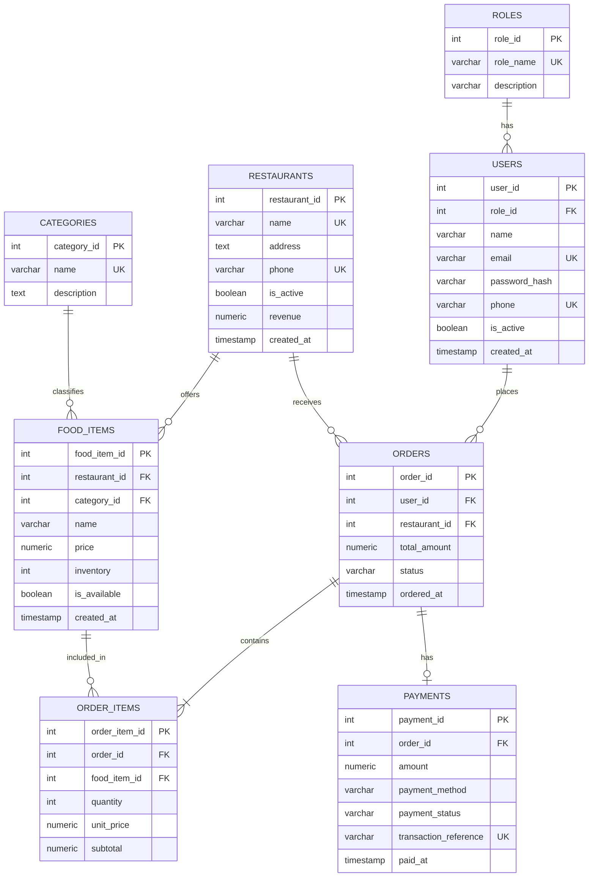

# ERD

```mermaid
erDiagram
    ROLES ||--o{ USERS : has
    USERS ||--o{ ORDERS : places
    RESTAURANTS ||--o{ FOOD_ITEMS : offers
    CATEGORIES ||--o{ FOOD_ITEMS : classifies
    RESTAURANTS ||--o{ ORDERS : receives
    ORDERS ||--|{ ORDER_ITEMS : contains
    FOOD_ITEMS ||--o{ ORDER_ITEMS : included_in
    ORDERS ||--o| PAYMENTS : has

    ROLES {
        int role_id PK
        varchar role_name UK
        varchar description
    }
    USERS {
        int user_id PK
        int role_id FK
        varchar name
        varchar email UK
        varchar password_hash
        varchar phone UK
        boolean is_active
        timestamp created_at
    }
    RESTAURANTS {
        int restaurant_id PK
        varchar name UK
        text address
        varchar phone UK
        boolean is_active
        numeric revenue
        timestamp created_at
    }
    CATEGORIES {
        int category_id PK
        varchar name UK
        text description
    }
    FOOD_ITEMS {
        int food_item_id PK
        int restaurant_id FK
        int category_id FK
        varchar name
        numeric price
        int inventory
        boolean is_available
        timestamp created_at
    }
    ORDERS {
        int order_id PK
        int user_id FK
        int restaurant_id FK
        numeric total_amount
        varchar status
        timestamp ordered_at
    }
    ORDER_ITEMS {
        int order_item_id PK
        int order_id FK
        int food_item_id FK
        int quantity
        numeric unit_price
        numeric subtotal
    }
    PAYMENTS {
        int payment_id PK
        int order_id FK
        numeric amount
        varchar payment_method
        varchar payment_status
        varchar transaction_reference UK
        timestamp paid_at
    }
```
