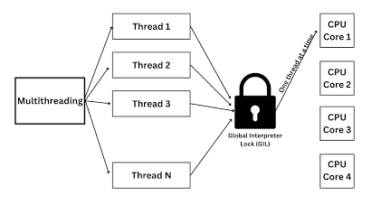
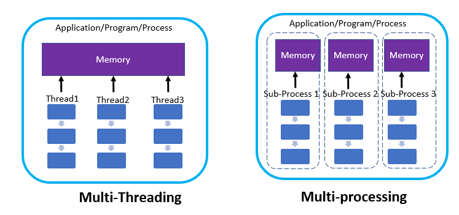

# Async Programming in Python

### topics

1. Blocking vs non-blocking I/O
2. Event loop
3. `async` / `await`
4. Coroutines
5. Tasks
6. `asyncio.gather()`
7. Threading vs multiprocessing
8. When to use each approach

## Some Important terms

- **rocess:** An independent, running program in memory that has its own dedicated resources, memory space, and security boundary allocated by the operating system.
- **Thread:** A lightweight, smaller execution unit inside a process that shares memory and resources with other threads in the same process.
- **Concurrency:** The ability to handle multiple tasks by switching between them or overlapping their execution over the same period of time.
- **Parallelism:** The ability to execute multiple tasks simultaneously at the exact same physical instant on multiple CPU cores.
- **Synchronous:** A blocking execution flow where each operation must finish completely before the next one can start.
- **Asynchronous:** A non-blocking execution flow where a program initiates a task and continues running other work without waiting for that task to finish.
- **I/O-Bound Task:** A task whose speed is limited by waiting for external input/output devices (like network requests, disk reads, or database queries).
- **CPU-Bound Task:** A task whose speed is limited by the processor's raw computation power (such as matrix math, encryption, video encoding, or image processing).
- **Event Loop:** A continuous, single-threaded coordinator that checks for completed asynchronous events and triggers their corresponding callback code.
- **Global Interpreter Lock (GIL):** A mutex ( s a synchronization lock used in multi-threaded programming to prevent multiple threads from accessing a shared resource at the exact same time. in Python (CPython) that prevents multiple native threads from executing Python bytecode simultaneously, ensuring thread-safe memory management at the cost of multi-core CPU parallelism.

## Python nature

Python is **multi-threaded in design**, but due to the **Global Interpreter Lock (GIL)** in standard Python (CPython), it executes **only one thread of Python bytecode at a time** on a single CPU core.

**Execution Bottleneck (The GIL):** Even if your machine has 8 or 16 CPU cores, CPython's **GIL** ensures only one thread runs Python code at any single instant.

- **For I/O Tasks (Network calls, File reads, DB queries):** Multi-threading works well because Python releases the GIL while waiting for network/disk responses.

- **For CPU Tasks (Math, Image processing, AI model loops):** Multi-threading does **not** speed up execution across multiple cores. To achieve true parallel CPU execution, you use `multiprocessing` (spawning separate Python processes) or C extensions/NumPy.

### Why the GIL Does Not Allow True Multi-threaded Parallelism

Python *does* allow you to create multiple threads, but the **Global Interpreter Lock (GIL)** prevents them from running on multiple CPU cores simultaneously.

The primary reason is **memory management via Reference Counting**:

- **Reference Counting in CPython:** Every Python object tracks how many variables point to it via an internal counter (`ob_refcnt`). When a reference count drops to `0`, Python immediately frees that memory.

- **The Race Condition Problem:** If two native threads running on separate CPU cores increment or decrement the reference count of the same object at the exact same moment:

  - Counts can become corrupted (race condition).

  - This leads to either **memory leaks** (memory never gets freed) or **fatal crashes**

## Asyncio

Python provides a library called:

```
import asyncio
```

It is used for:

> Writing concurrent code using `async`/`await`, particularly for I/O-bound operations.

An asynchronous function is declared using:

```
async def hello():
print("Hello")
```

This creates a **coroutine function**.

A **coroutine** is a specialized function that can **pause its execution halfway through, yield control back to the caller or event loop, and resume later right where it left off**, preserving all its local variables.

subroutine functions goes from start to end and return or give error

It creates a coroutine object.

You normally execute it using:

```
asyncio.run(hello())
```

Complete example:

```
import asyncio
async def hello():

print("Hello")

asyncio.run(hello())
```

Output:

```
Hello
```

## Await

`await` tells Python:

> Wait for this asynchronous operation, and while it is waiting, allow the event loop to handle other eligible work.

Example:

```
import asyncio
async def hello():

print("Start")

await asyncio.sleep(2)

print("End")

asyncio.run(hello())
```

```
time.sleep()

Event loop
   ↓
time.sleep()
   ↓
BLOCKED
await asyncio.sleep()
Event loop
   ↓
await
   ↓
Coroutine pauses
   ↓
Event loop can run other tasks
```

## Event loop

## Definition

> An event loop is the mechanism that manages and schedules asynchronous tasks, running them when they are ready to make progress.

The event loop switches between coroutines when they reach points where they can yield control, such as `await`.

# `asyncio.create_task()`

Syntax:

```
task = asyncio.create_task(coroutine())
```

# `asyncio.gather()`

Another common approach is:

```
await asyncio.gather(
task1(),

task2()

)
```

gather → run multiple operations and wait for all their results.

create_task → Useful when you want explicit task objects and more control over their lifecycle.

# Coroutine vs Task

This distinction is important.

### Coroutine

An awaitable asynchronous computation.

```
fetch_data()
```

### Task

A coroutine scheduled to run by the event loop.

```
asyncio.create_task(fetch_data())
```

Courotine

↓

Schedule it

↓

Task

↓

Event Loop

↓

Execution

### asnycio.run() → manages event loop for execution

## multiThreading and mutiprocessing

**Multithreading** runs multiple execution units within the same process sharing the same memory, while **Multiprocessing** spawns entirely separate processes, each with its own dedicated memory and Python interpreter instance.

### Key Comparison

<table style="min-width: 75px;">
<colgroup><col style="min-width: 25px;"><col style="min-width: 25px;"><col style="min-width: 25px;"></colgroup><tbody><tr><td colspan="1" rowspan="1"><p><strong>Feature</strong></p></td><td colspan="1" rowspan="1"><p><strong>Multithreading (threading)</strong></p></td><td colspan="1" rowspan="1"><p><strong>Multiprocessing (multiprocessing)</strong></p></td></tr><tr><td colspan="1" rowspan="1"><p><strong>Memory Space</strong></p></td><td colspan="1" rowspan="1"><p><strong>Shared</strong> across all threads in the process.</p></td><td colspan="1" rowspan="1"><p><strong>Isolated</strong> (each process gets its own RAM space).</p></td></tr><tr><td colspan="1" rowspan="1"><p><strong>GIL Impact</strong></p></td><td colspan="1" rowspan="1"><p>Bound by a single GIL (one thread at a time for Python bytecode).</p></td><td colspan="1" rowspan="1"><p>Bypasses the GIL (each process has its own GIL on separate CPU cores).</p></td></tr><tr><td colspan="1" rowspan="1"><p><strong>Creation Overhead</strong></p></td><td colspan="1" rowspan="1"><p>Lightweight, fast startup, low RAM footprint.</p></td><td colspan="1" rowspan="1"><p>Heavier, slower to spawn, higher RAM consumption.</p></td></tr></tbody>
</table>

## Threading

allows a program to split itself into multiple lightweight execution streams (threads) that run concurrently inside the same process, sharing the same memory space.

```
import threading
import time


def worker(name):
    print(f"{name} started")
    time.sleep(2)
    print(f"{name} finished")


t1 = threading.Thread(target=worker, args=("Thread 1",))
t2 = threading.Thread(target=worker, args=("Thread 2",))

t1.start()
t2.start()

t1.join()
t2.join()

print("All threads finished")
```

will execute it in 2 seconds 

- `threading.Thread`: The worker blueprint. It creates a new thread of execution and assigns it a target function to run.
- `target`: The specific function you assign to the thread to execute (e.g., `worker`).
- `args`: The parameters/inputs passed into the target function, formatted as a tuple (e.g., `("Thread 1",)`).
- `.start()`: Pushes the "GO" button. It tells the operating system to spin up the thread and begin running the target function in the background immediately.
- `.join()`: The barrier / wait signal. It tells the main program: *"Pause here and do not proceed until this specific background thread has completely finished its job."*
- **Shared Memory**: All threads inside the same Python process can directly read and modify the exact same global variables, lists, and objects without serialization.
- **Thread Safety**: Writing code in a way that prevents simultaneous modifications of shared variables from corrupting data.
- **Lock / Mutex (**`threading.Lock`**)**: A digital padlock used to ensure only one thread modifies a shared resource at a single moment to prevent race conditions.

## useful for http request

## Multiprocessing 

`Process`**:** The factory blueprint. Unlike a thread, it spawns an entirely independent operating system process with its own PID (Process ID), its own memory space, and its own Python interpreter + GIL instance.

- `p1.start()` **&** `p2.start()`**:** Triggers the OS to allocate new memory and spin up the child processes on separate CPU cores simultaneously.
- `p1.join()` **&** `p2.join()`**:** Blocks the parent process until both child workers finish their loops.